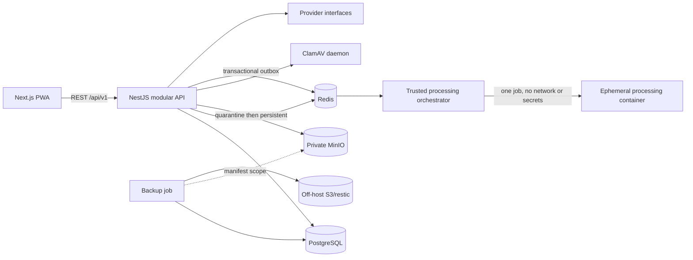
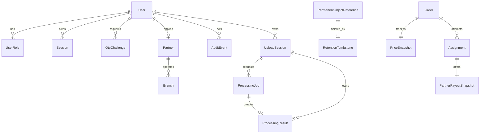

# Architecture

## Context

The platform is a modular NestJS monolith with a Next.js PWA. PostgreSQL is the
source of truth, Redis supports queues/rate limits, and MinIO is private object
storage. Provider ports isolate OTP, antivirus, isolated processing, payment,
file storage, notifications, maps, and delivery. Stage 3 implements protected
uploads and the isolated processing foundation, but no user preview or order
workflow.

## Modules

- Identity: OTP challenges, users, role assignments, access/refresh sessions.
- Partner: application, branch, approval.
- Admin: one-time bootstrap and guarded moderation.
- Audit: bounded event names and redacted metadata.
- Health/metrics: readiness and low-cardinality telemetry.
- Upload: quota reservation, quarantine, structural validation, antivirus,
  cancellation, expiry and cleanup.
- Processing: transactional outbox, BullMQ delivery, database inbox, CAS lease,
  isolated normalization and output revalidation.
- Future ports: payments, notifications, maps, delivery.

## Future order aggregates

`Order` owns versioned state, one active `Assignment`, `PriceSnapshot`, and idempotent refund. Each `PARTNER_OFFERED` attempt owns an immutable `PartnerPayoutSnapshot`; rejected/expired snapshots remain auditable.

`PermanentObjectReference` records the opaque object key, SHA-256 checksum,
bounded retention class and expiry used to build an allow-list backup manifest.
A tombstone is durable deletion intent. Restore must replay every tombstone
before API traffic is permitted, including against stale objects already
present in the recovery bucket.

`UploadSession` reserves quota before bytes are accepted. It stores only a
bounded file kind and declared media type; original filenames are not persisted.
Each accepted file version creates one `ProcessingJob`. Its deduplication key
is SHA-256 over file version, bounded operation and settings hash. A unique
`OutboxEvent` is committed with the upload transition. BullMQ delivery is
disposable; `InboxOperation`, the unique job result and aggregate-version CAS
are authoritative.

## State machine contract

Primary: `DRAFT → FILE_PROCESSING → AWAITING_LAYOUT_APPROVAL → AWAITING_PAYMENT → PAID → MATCHING → PARTNER_OFFERED → PARTNER_ACCEPTED → IN_PRODUCTION → READY → AWAITING_PICKUP → COURIER_ASSIGNED → IN_DELIVERY → COMPLETED`.

Exceptions: `QUALITY_CHECK_FAILED`, `MANUAL_REVIEW_REQUIRED`, `CLARIFICATION_REQUIRED`, `PROCESSING_FAILED`, `REASSIGNING`, `CANCELLED`, `DELIVERY_FAILED`, `DISPUTED`, `REPRINT`, `PARTIALLY_REFUNDED`, `REFUNDED`.

No direct status writes are allowed. Aggregate version compare-and-swap, a transactional outbox, worker inbox, stable deduplication keys, provider idempotency keys, bounded retries, and dead-letter/manual review are mandatory.

## Matching decision

Hard-filter by capability, equipment, format/material, volume, hours, inventory, and service zone. Rank remaining branches by the selected bounded weight profile. An offer has a three-minute default TTL and an immutable payout snapshot. A unique active assignment plus row lock prevents double acceptance. Exhausting candidates creates one refund request; the order becomes `REFUNDED` only after provider confirmation.

## ADRs

1. Modular monolith before microservices: lowest coordination cost while retaining module boundaries.
2. TypeScript domain core: shared contracts and one application type system; Python is restricted to the future processing sandbox.
3. PostgreSQL is authoritative; Redis is disposable and never the only record of business state.
4. Manual printing: approved production files are downloaded by the partner; no printer/device integration in MVP.
5. One partner per order: incompatible lines are split before payment.

## Stage 3 processing sandbox

LibreOffice/OpenCV/Tesseract tooling exists only in an ephemeral processing
image. The trusted worker transfers one opaque input into a per-job Docker
volume and mounts it read-only; a different per-job volume receives output.
The child has no network, environment secrets, DB, Redis, object-store access,
capabilities or privileges. It uses a read-only root, `no-new-privileges`,
seccomp, a non-root UID, CPU/RAM/PID/time limits, a private temporary
LibreOffice profile and no macro-capable input format. Network isolation also
blocks external document links. Output is signature/page/size checked and
rescanned before persistence. User preview and full preflight remain stage 4.
