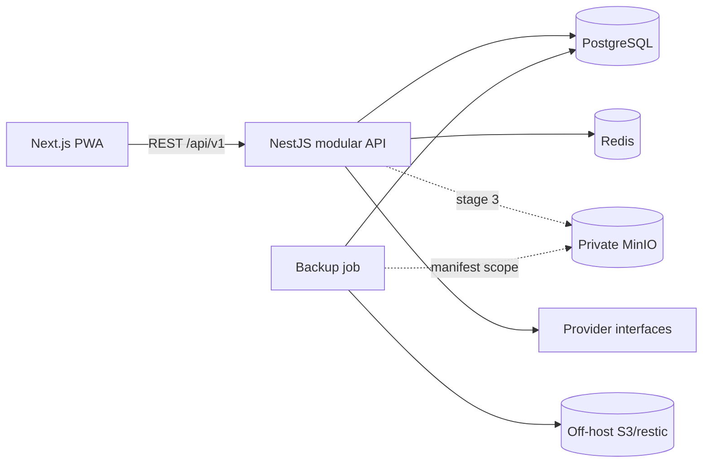
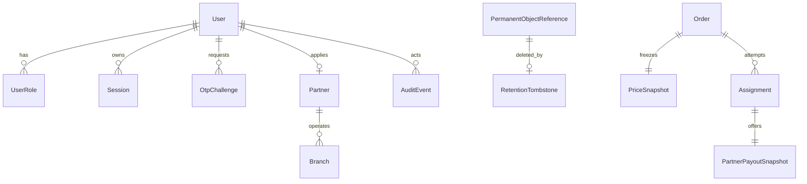

# Architecture

## Context

The platform is a modular NestJS monolith with a Next.js PWA. PostgreSQL is the source of truth, Redis supports queues/rate limits, and MinIO is private object storage. Provider ports isolate OTP, payment, file storage, notifications, maps, and delivery. Stage 2 implements identity and partner onboarding only.

## Modules

- Identity: OTP challenges, users, role assignments, access/refresh sessions.
- Partner: application, branch, approval.
- Admin: one-time bootstrap and guarded moderation.
- Audit: bounded event names and redacted metadata.
- Health/metrics: readiness and low-cardinality telemetry.
- Future ports: files, payments, notifications, maps, delivery.

## Future order aggregates

`Order` owns versioned state, one active `Assignment`, `PriceSnapshot`, and idempotent refund. Each `PARTNER_OFFERED` attempt owns an immutable `PartnerPayoutSnapshot`; rejected/expired snapshots remain auditable.

`PermanentObjectReference` and `RetentionTombstone` are stage 2 infrastructure records, not upload APIs. The reference records the object key, SHA-256 checksum, bounded retention class and expiry used to build an allow-list backup manifest. A tombstone is durable deletion intent. Restore must replay every tombstone before API traffic is permitted, including against stale objects already present in the recovery bucket.

## State machine contract

Primary: `DRAFT → FILE_PROCESSING → AWAITING_LAYOUT_APPROVAL → AWAITING_PAYMENT → PAID → MATCHING → PARTNER_OFFERED → PARTNER_ACCEPTED → IN_PRODUCTION → READY → AWAITING_PICKUP → COURIER_ASSIGNED → IN_DELIVERY → COMPLETED`.

Exceptions: `QUALITY_CHECK_FAILED`, `MANUAL_REVIEW_REQUIRED`, `CLARIFICATION_REQUIRED`, `PROCESSING_FAILED`, `REASSIGNING`, `CANCELLED`, `DELIVERY_FAILED`, `DISPUTED`, `REPRINT`, `PARTIALLY_REFUNDED`, `REFUNDED`.

No direct status writes are allowed. Aggregate version compare-and-swap, a transactional outbox, worker inbox, stable deduplication keys, provider idempotency keys, bounded retries, and dead-letter/manual review are mandatory.

## Matching decision

Hard-filter by capability, equipment, format/material, volume, hours, inventory, and service zone. Rank remaining branches by the selected bounded weight profile. An offer has a three-minute default TTL and an immutable payout snapshot. A unique active assignment plus row lock prevents double acceptance. Exhausting candidates creates one refund request; the order becomes `REFUNDED` only after provider confirmation.

## ADRs

1. Modular monolith before microservices: lowest coordination cost while retaining module boundaries.
2. TypeScript domain core: shared contracts and one application type system; Python is restricted to the future processing sandbox.
3. PostgreSQL is authoritative; Redis is disposable and never the only record of business state.
4. Manual printing: approved production files are downloaded by the partner; no printer/device integration in MVP.
5. One partner per order: incompatible lines are split before payment.

## Future processing sandbox

LibreOffice/OCR runs in an ephemeral container with no network, secrets, DB, Redis, or object-store access. It has a read-only root, no capabilities/privileges, `no-new-privileges`, seccomp, CPU/RAM/PID/time limits, disabled macros/external links, a per-job profile, read-only input, separate output, and output revalidation. Stage 2 contains no processing code.
