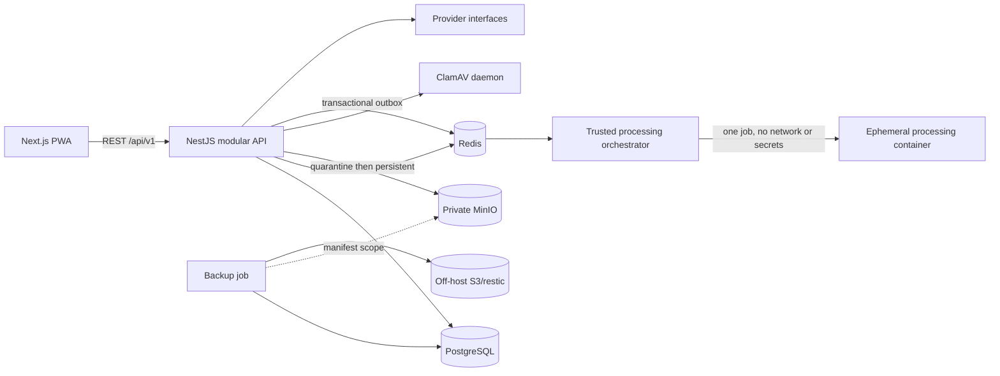
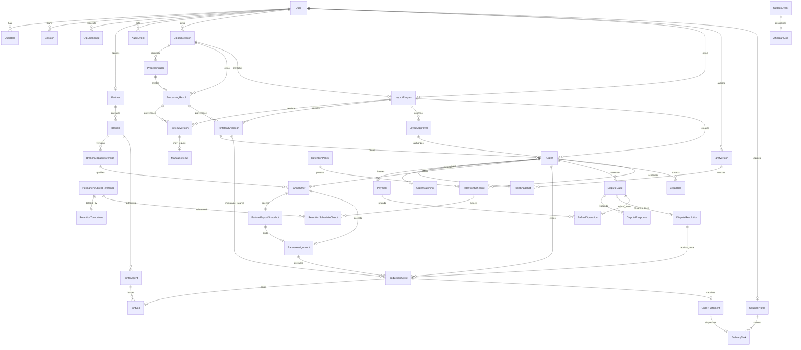

# Architecture

## Context

The platform is a modular NestJS monolith with a Next.js PWA. PostgreSQL is the
source of truth, Redis supports queues/rate limits, and MinIO is private object
storage. Provider ports isolate OTP, antivirus, isolated processing, payment,
file storage, notifications, maps, and delivery. Stage 3 implements protected
uploads, isolated processing and stage 4 preflight/layout approval, but no
order workflow.

## Modules

- Identity: OTP challenges, users, role assignments, access/refresh sessions.
- Partner: application, branch, approval and versioned matching capabilities.
- Admin: one-time bootstrap and guarded moderation.
- Audit: bounded event names and redacted metadata.
- Health/metrics: readiness and low-cardinality telemetry.
- Upload: quota reservation, quarantine, structural validation, antivirus,
  cancellation, expiry and cleanup.
- Processing: transactional outbox, BullMQ delivery, database inbox, CAS lease,
  isolated normalization and output revalidation.
- Layout: preflight of stage 3-ready sources, immutable preview/print-ready
  versions, bounded manual review and optimistic customer approval.
- Commerce: versioned tariffs, order eligibility, immutable UZS price
  snapshots, idempotent mock payment callbacks and full refunds.
- Matching: deterministic candidates, sequential TTL offers, immutable payout
  snapshots, one active assignment and manual production through READY.
- Fulfillment: branch printer-agent leases, protected pickup, courier
  onboarding/assignment, encrypted delivery data and completion.
- Aftercare: bounded disputes and immutable resolutions, same-partner reprint
  cycles, cumulative refund reservation, legal holds and durable object deletion.
- Finance operations: production provider selection, immutable fiscal records,
  append-only partner ledger, settlement batches and explicit reconciliation.
- Future ports: vendor-specific payment/fiscal integrations and external dispatch.

## Stage 5 order aggregates

`Order` owns versioned payment/matching state and exactly one immutable
`PriceSnapshot`. Matching owns historical offers and payout snapshots.

`PermanentObjectReference` records the opaque object key, SHA-256 checksum,
bounded retention class and expiry used to build an allow-list backup manifest.
A tombstone is durable deletion intent. Restore must replay every tombstone
before API traffic is permitted, including against stale objects already
present in the recovery bucket.

`UploadSession` reserves quota before bytes are accepted. It stores only a
bounded file kind and declared media type; original filenames are not persisted.
Each accepted file version creates one `ProcessingJob`. Its deduplication key
is SHA-256 over file version, bounded operation and settings hash. A unique
`OutboxEvent` is committed with the upload transition. BullMQ delivery is
disposable; `InboxOperation`, the unique job result and aggregate-version CAS
are authoritative.

## State machine contract

Primary: `DRAFT → FILE_PROCESSING → AWAITING_LAYOUT_APPROVAL → AWAITING_PAYMENT → PAID → MATCHING → PARTNER_OFFERED → PARTNER_ACCEPTED → IN_PRODUCTION → READY → AWAITING_PICKUP → COURIER_ASSIGNED → IN_DELIVERY → COMPLETED`.

Exceptions: `QUALITY_CHECK_FAILED`, `MANUAL_REVIEW_REQUIRED`, `CLARIFICATION_REQUIRED`, `PROCESSING_FAILED`, `REASSIGNING`, `CANCELLED`, `DELIVERY_FAILED`, `DISPUTED`, `REPRINT`, `PARTIALLY_REFUNDED`, `REFUNDED`.

No direct status writes are allowed. Aggregate version compare-and-swap, a transactional outbox, worker inbox, stable deduplication keys, provider idempotency keys, bounded retries, and dead-letter/manual review are mandatory.

## Matching decision

Hard-filter by capability, equipment, format/material, volume, hours, inventory, and service zone. Rank remaining branches by the selected bounded weight profile. An offer has a three-minute default TTL and an immutable payout snapshot. A unique active assignment plus row lock prevents double acceptance. Exhausting candidates creates one refund request; the order becomes `REFUNDED` only after provider confirmation.

## ADRs

1. Modular monolith before microservices: lowest coordination cost while retaining module boundaries.
2. TypeScript domain core: shared contracts and one application type system; Python is restricted to the future processing sandbox.
3. PostgreSQL is authoritative; Redis is disposable and never the only record of business state.
4. Production adapter: manual partner download remains a compatible fallback;
   stage 7 adds a branch-local pull agent with hashed machine credentials,
   bounded leases and an OS spool boundary. Hardware drivers remain external.
5. One partner per order: incompatible lines are split before payment.

## Stage 3 processing sandbox

LibreOffice/OpenCV/Tesseract tooling exists only in an ephemeral processing
image. The trusted worker transfers one opaque input into a per-job Docker
volume and mounts it read-only; a different per-job volume receives output.
The child has no network, environment secrets, DB, Redis, object-store access,
capabilities or privileges. It uses a read-only root, `no-new-privileges`,
seccomp, a non-root UID, CPU/RAM/PID/time limits, a private temporary
LibreOffice profile and no macro-capable input format. Network isolation also
blocks external document links. Output is signature/page/size checked and
rescanned before persistence.

## Stage 4 artifact and approval invariants

`LayoutRequest` is the mutable aggregate pointer. `PreviewVersion` and
`PrintReadyVersion` are append-only records with SHA-256, byte size, page count,
source file UUID, settings hash and origin `ProcessingResult`. The composite
source/settings uniqueness constraint makes identical reprocessing idempotent.
Opaque object keys are never returned by the API.

Preflight checks page readability, encryption/corruption, page count and
geometry, orientation, decoded image resolution and result validity. DOCX uses
the same isolated LibreOffice path as stage 3. A bounded confidence result for
document-photo background, head position or size creates one pending
`ManualReview`. Only `ADMIN` may decide it; the decision is CAS-protected and
audited with bounded metadata.

An approval references one immutable preview and the observed aggregate
version. The transaction permits only the latest preview in
`AWAITING_APPROVAL`; concurrent or stale confirmations return conflict. A new
source version or settings hash clears `currentApprovalId` before processing.

## Stage 5 pricing and payment invariants

Only an `APPROVED` layout whose `currentApprovalId`, latest preview,
print-ready provenance and aggregate version still agree can create an order.
The transaction copies the active tariff version, bounded source parameters,
line items, quantity, discount, currency and total into `PriceSnapshot`.
All money is PostgreSQL `BIGINT` exposed as decimal strings; MVP currency is
`UZS`. Later tariff versions cannot mutate an existing snapshot.

Create-order, payment-start and synthetic no-executor refund commands require
an idempotency key. Only SHA-256 key and canonical request digests are stored;
same-key/same-payload replays the prior response and changed payload conflicts.
Provider callbacks require HMAC, persist unique provider event IDs and reject
invalid ordering. Every domain transition and outbox event share one database
transaction. A refund holds both aggregates in `REFUND_PENDING` until a signed
provider confirmation moves them to `REFUNDED`.

## Stage 6 matching and production invariants

Only `PAID` enters matching. Candidate hard filters require an approved active
partner, active branch, active immutable capability version, supported file
kind, page capacity, dimensions and DPI. Ranking is deterministic: configured
priority, mock-map distance, then stable branch UUID. External maps and paid
notification APIs are not called.

Offers are sequential and retain rejected/expired history. Every offer creates
one append-only `PartnerPayoutSnapshot`; PostgreSQL rejects update/delete and
checks one active assignment per order with a partial unique index. Acceptance
locks the order row and applies aggregate-version CAS in the same transaction
as the assignment and outbox event. BullMQ expiry uses the outbox dedup key and
the PostgreSQL inbox, so redelivery cannot advance twice.

When candidates are exhausted, `OrderMatching` becomes `EXHAUSTED` and a
durable outbox intent prevents any later offer. The consumer invokes the stage
5 full-refund command with a stable key; provider confirmation remains required
for `REFUNDED`. Partners receive only their assigned print-ready signed URL and
manually transition `PARTNER_ACCEPTED → IN_PRODUCTION → READY`.

## Stage 7 fulfillment invariants

`PARTNER_ASSIGNED` creates at most one `PrintJob`. A branch-local agent uses a
256-bit bearer credential whose HMAC digest is stored, atomically leases only
its branch job and receives a freshly signed no-store URL. Agent and manual
production cannot advance the same job concurrently; a manual start cancels an
unclaimed agent job, while an active agent lease blocks the manual path.

Only an owned `READY` order may create one `OrderFulfillment`. The completion
PIN is deterministically derived from a deployment secret and random nonce;
only its HMAC digest and bounded attempts/expiry are stored. Delivery addresses
use AES-256-GCM and are decrypted only for the assigned approved courier.
Delivery assignment is deterministic within the branch service zone and is
committed with the order transition and outbox event. Partner/courier handoff
uses a separate derived PIN. Normal terminal paths are
`READY → AWAITING_PICKUP → COMPLETED` and
`READY → AWAITING_PICKUP → COURIER_ASSIGNED → IN_DELIVERY → COMPLETED`.
Provider or courier failure reaches `DELIVERY_FAILED`; reverse and skipped
transitions are rejected.

## ADR 8: aftercare is append-only history over an existing paid order

Stage 7 remains the baseline. Stage 8 changes the database cardinality from
one fulfillment/job per order to one per ProductionCycle, without changing the
stage 7 endpoint paths. Migration backfills ORIGINAL cycles for historical
assignments, including inactive completed assignments. Reprint cycles keep the
same assignment and immutable PrintReadyVersion; no matching, new approval,
price recalculation or new partner payout occurs.

Orders enter DISPUTED only within 72 hours of disputeEligibleAt, which is set
by COMPLETED or DELIVERY_FAILED. Cancelling or resolving NO_ACTION returns the
prior status without extending that timestamp. REPRINT creates a new cycle/job
and follows REPRINT → IN_PRODUCTION → READY, then existing pickup/delivery
transitions. Each new fulfillment has a fresh PIN; old PINs and old printer
leases cannot authorize the new cycle.

Resolution choices are NO_ACTION, REPRINT, PARTIAL_REFUND and FULL_REFUND.
Refund decisions reserve the amount and move order/payment to REFUND_PENDING;
only the signed provider callback sets PARTIALLY_REFUNDED or REFUNDED.
PostgreSQL locks the payment before checking all reserved/confirmed amounts.
PriceSnapshot, PartnerPayoutSnapshot, DisputeResolution and DisputeResponse are
immutable; cycle source/assignment lineage is immutable too.

Aftercare commands acquire the retention advisory lock before the order lock,
re-read idempotency, apply aggregate CAS and commit outbox + safe audit in one
transaction. The aftercare BullMQ queue is a transport; AftercareJob leases,
five-attempt limit, inbox and idempotent provider calls are authoritative.
A periodic durable retention sweep excludes active holds and nonterminal
orders. Tombstone intent commits before storage deletion and remains retryable
after a crash. Legal/financial database records are not automatically purged.
