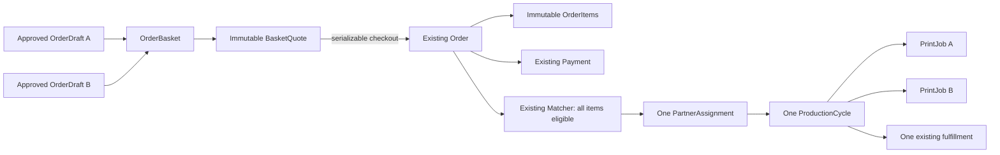

# Stage 15 Proposal — Multi-item Single-Studio Print Basket

Status: approved implementation and acceptance baseline.

## Current accepted baseline

Stage 15 starts from the accepted Stage 14 commit
`50d75e2bcc840fd95a9ce4756c514befa42c36ed` and GitHub Actions run
`37619424935`. On that exact SHA, `quality` and `infrastructure` succeeded, the
sequential Stage 1–13 regression passed, Stage 14 DB-E2E passed 7/7, mandatory
Playwright passed 2/2 on the first attempt, clean and repeated migrations
passed, and encrypted backup, isolated restore and payment-lineage validation
passed. `main` matched `origin/main` with 0/0 divergence and a clean tree.

The following accepted invariants remain authoritative:

- one `Order` has one customer, one immutable `PriceSnapshot`, at most one
  successful `Payment`, one active partner assignment and one fulfillment
  destination;
- prices and all financial records use integer minor units in UZS;
- files remain private and are represented by immutable approved
  `PrintReadyVersion` records, never by customer-supplied object references;
- matching, offer capacity, assignment, production, fulfillment, aftercare and
  finance use the existing state machines, transactional outbox/inbox,
  idempotency and aggregate CAS;
- production adapters fail closed. The repository contains no real OTP,
  acquiring, fiscal, payout, maps or courier credentials;
- customer presentation supports exactly Uzbek (`uz`), Russian (`ru`) and
  English (`en`). Locale never participates in domain state, pricing,
  idempotency, payment or fulfillment decisions.

Stage 15 must extend those aggregates. It must not create a second ordering,
matching, payment, production or fulfillment pipeline.

## Repository gap analysis

### Capabilities already present

| Area                       | Accepted capability after Stage 14                                                                                          |
| -------------------------- | --------------------------------------------------------------------------------------------------------------------------- |
| Identity                   | Secure OTP boundary, session rotation, CSRF/origin checks and role isolation.                                               |
| Files                      | PDF, DOCX, JPG/JPEG and PNG quarantine, antivirus, isolated processing, preview, print-ready output and retention.          |
| Customer ordering          | Mobile-first catalog-to-completion journey, resumable draft, authoritative quote, checkout, timeline and notifications.     |
| Catalog and pricing        | Immutable platform catalog/tariff versions, bounded options, integer UZS pricing and fulfillment fee.                       |
| Studio network             | Moderated listings, capabilities, availability, capacity, service area, preference and deterministic fallback.              |
| Payment                    | Durable attempts, authoritative confirmation/recovery, callback replay protection and fail-closed production configuration. |
| Production and fulfillment | One partner, printer-agent lease, manual production, pickup PIN, bounded delivery and completion.                           |
| Aftercare and finance      | Disputes, reprints, refunds, fiscal records, partner ledger, settlements and reconciliation.                                |
| Operations                 | Sequential CI regression, low-cardinality metrics, encrypted backup, tombstone replay and isolated restore.                 |

### Material gaps

1. An `OrderDraft`, `PriceQuote` and `Order` still represent exactly one
   catalog item, upload, approval and print-ready artifact. A normal customer
   cannot pay for two documents or a document and photos in one purchase.
2. Matching proves that a branch can produce one configuration, not that the
   same branch can safely produce every requested item under one capacity
   reservation.
3. One `ProductionCycle` currently owns one print-ready version and one
   `PrintJob`. There is no atomic batch-completion rule for several artifacts.
4. The customer must repeat studio choice, fulfillment choice, payment and
   pickup/delivery for every file, which is not a practical print-shop MVP.
5. `PriceSnapshot.lineItems` can describe several charges, but there is no
   normalized immutable per-item lineage from catalog and approval through
   production, payout, dispute and restore.
6. Catalog persistence and draft DTOs predate the permanent three-language
   requirement: published catalog content has RU/UZ columns and new-draft
   locale validation does not yet accept `en`. Stage 14 customer payment copy
   is trilingual, but the complete catalog/order journey is not yet
   structurally complete in English.
7. Inventory-backed stationery and souvenirs are absent. They require stock,
   reservation, procurement and returns semantics and should not be mixed into
   the file-printing batch milestone.
8. Real money collection and external messaging/fiscal/delivery providers are
   configured behind ports but remain externally blocked by contracts and
   credentials.

## Stage 15 objective

Enable a customer to prepare several independently approved print/photo items,
place them into one resumable basket, receive one server-authoritative total,
pay once, route the complete basket to one fully eligible studio, produce every
item, and receive one pickup or delivery through the existing order lifecycle.

The measurable customer result is:

`catalog → prepare item A → add to basket → prepare item B → basket review →`
`studio/fulfillment → authoritative quote → one checkout/payment → one studio →`
`all items produced → one pickup/delivery → completed`

## Why this is the correct next milestone

- It removes the largest usability constraint in the now-complete purchase
  journey: one payment currently buys only one prepared file.
- It deepens the core print/photo proposition rather than adding an unrelated
  feature such as reviews, chat or loyalty.
- It can be fully implemented and verified with existing provider-neutral
  infrastructure; no external credentials are needed.
- It reuses the established catalog, upload, approval, pricing, matching,
  payment, fulfillment, aftercare and finance aggregates.
- It retains one partner and one destination, avoiding premature multi-partner
  splitting, split payments and partial shipment state machines.
- It establishes normalized order-item lineage that a later, separately
  approved inventory vertical may reuse without pretending that physical stock
  already exists.

## In scope

1. An owner-scoped, resumable basket containing 1–10 existing Stage 11 order
   drafts, each with its own configuration, upload, current approval and
   print-ready artifact.
2. Add, remove and reorder item operations protected by basket version CAS and
   `Idempotency-Key`.
3. Exactly one basket-level studio preference and one basket-level pickup or
   delivery preference. Every item shares the same studio, address and
   fulfillment cycle.
4. An immutable, expiring basket quote with per-item catalog, tariff,
   configuration, approval, print-ready and money lineage. The fulfillment fee
   is applied once per basket.
5. One existing `Order` created transactionally from the basket, with immutable
   normalized `OrderItem` rows and one existing `PriceSnapshot` containing the
   matching itemized total.
6. One existing payment aggregate/attempt sequence for the full basket total.
7. Existing matching extended so a candidate is eligible only if it can
   produce every item. Preferred-studio priority and fallback remain subject to
   full aggregate eligibility.
8. One atomic capacity reservation whose demand is the deterministic aggregate
   of all basket items.
9. A production cycle containing immutable per-item production records and one
   printer-agent/manual print job per item. The order reaches `READY` only when
   every required item is complete.
10. Existing pickup/delivery, payout, fiscal, ledger and completion behavior
    applied once to the basket order.
11. Item-aware aftercare: an optional immutable item scope on a dispute;
    reprint can reproduce the resolved subset while full-order behavior remains
    compatible. Refund caps remain based on paid amount and immutable item
    allocations.
12. RU/UZ/EN mobile-first basket, summary, recovery, error, order-detail and
    production-status presentation.
13. ADMIN catalog publication updated so every newly published customer-facing
    item has complete Uzbek, Russian and English content.
14. Partner production and printer-agent views showing the bounded item
    manifest for only the assigned order, with separate short-lived access to
    each print-ready artifact.
15. OpenAPI, ERD, architecture, state-machine, threat-model, operations,
    testing and recovery documentation.

## Explicitly out of scope

- inventory-backed stationery, souvenir SKUs, stock reservations, warehouses,
  procurement and physical-goods returns;
- more than one partner or studio per order, automatic order splitting,
  partial partner acceptance or multiple fulfillment destinations;
- split tenders, per-item payments, cash on delivery, installments,
  multi-currency, promotion codes, loyalty or subscriptions;
- post-payment add/remove/reconfigure operations;
- new file formats, document/photo editors, restoration, design services or
  arbitrary customer instructions;
- real Click, Payme, Uzum, OTP/SMS, fiscal, payout, maps/geocoding, courier or
  outbound-notification integrations;
- live GPS, route optimization, ETA, courier marketplace, reviews, ratings,
  chat or support evidence uploads;
- redesign of accepted single-item orders or destructive removal of legacy
  columns;
- Stage 16 implementation or speculative provider credentials.

## Architecture

Stage 15 remains inside the NestJS modular monolith. The ordering module owns a
new basket aggregate and composes existing drafts. `Order` remains the purchase
aggregate and the only input to payment, matching, production, fulfillment,
aftercare and finance.

No provider receives file content except through the existing private
print-ready access boundary. Payment, fiscal and payout providers receive only
the existing order-level references and integer aggregate amounts.

## Domain model

### `OrderBasket`

- owner, status (`ACTIVE`, `QUOTED`, `CHECKED_OUT`, `CANCELLED`, `EXPIRED`),
  locale, version, expiry and optional checked-out order;
- one mutable studio preference and one encrypted fulfillment preference while
  active;
- at most ten active items and exactly one active basket quote;
- locale is presentation metadata only and accepts exactly `uz`, `ru`, `en`.

### `OrderBasketItem`

- references one existing `OrderDraft` and has an immutable basket-local
  sequence once quoted;
- a draft may belong to at most one active basket;
- adding a draft does not copy file or layout data and does not bypass its own
  latest-approval rules;
- removal/reordering increments basket version and invalidates the active
  quote, never deleting the underlying draft.

### `BasketQuote` and `BasketQuoteItem`

- freeze basket version, ordered item set, catalog/tariff versions,
  configuration hashes, current approvals, print-ready versions, fulfillment
  rule, item subtotals, one fulfillment fee, total and expiry;
- use integer UZS exclusively;
- are append-only. Replacement expires the previous quote rather than editing
  it.

### `OrderItem`

- immutable order-local sequence, service/catalog lineage, configuration,
  quantity, upload/layout/approval/print-ready lineage and allocated subtotal;
- contains no original filename, object key, signed URL or customer text;
- legacy accepted orders receive exactly one backfilled `OrderItem`;
- legacy `Order.layoutId`, `layoutApprovalId` and `printReadyVersionId` remain
  populated from item 1 for compatibility. New domain code uses `OrderItem` as
  the authoritative collection.

### Production item lineage

`ProductionCycleItem` binds one `OrderItem` and its immutable
`PrintReadyVersion` to a production cycle. `PrintJob` references one cycle item.
The cycle succeeds only after all required item jobs succeed. A failed item
keeps the cycle non-ready and uses bounded failure/manual-review behavior; it
must not silently complete the rest of the order.

### Existing aggregate changes

- `Order` gains basket and item relations but keeps the accepted status
  machine and one assignment/payment/fulfillment.
- `PriceSnapshot` remains one immutable order-level snapshot. Its canonical
  item lines must equal normalized `OrderItem` allocations plus one fulfillment
  line.
- `PartnerPayoutSnapshot` remains one immutable order-level snapshot and
  includes a bounded canonical per-item calculation input.
- `DisputeCase` may optionally identify immutable item scope. Existing null
  scope means the whole order.
- `ProductionCycle` becomes a batch with one or more cycle items. Existing
  `printReadyVersionId` remains the legacy primary-item pointer during the
  compatibility period.

## Database and schema changes

The implementation proposal requires one forward-only additive Prisma
migration containing:

- enums for basket and basket-quote lifecycle;
- `OrderBasket`, `OrderBasketItem`, `BasketQuote`, `BasketQuoteItem`,
  `OrderItem` and `ProductionCycleItem` tables;
- nullable `basketId` on `Order` and optional item scope on `DisputeCase`;
- nullable `productionCycleItemId` on `PrintJob`, followed by a verified
  backfill and the new uniqueness rule;
- complete English catalog fields (`titleEn`, `descriptionEn`) and a database
  check allowing exactly `uz`, `ru`, `en` for persisted customer locale;
- unique constraints for one checked-out order per basket, one active basket
  membership per draft, ordered item sequences, one order item per source
  draft, one quote item per basket item and one print job per cycle item;
- immutable triggers for basket quotes, quote items, order items and production
  cycle item source fields;
- checks for 1–10 item count at quote/checkout, positive quantity, UZS-only
  amounts, non-negative allocations and exact allocation totals;
- indexes for owned active baskets, expiry, quote lookup, order-item production
  and job recovery.

The migration backfills one `OrderItem` for every existing order and one
`ProductionCycleItem` for every existing production cycle. Backfill must be
deterministic and rerunnable with `ON CONFLICT DO NOTHING` or equivalent unique
guards. No existing financial snapshot is recomputed.

English fields may be nullable for legacy catalog versions during expand
deployment, but publication of a new catalog version is rejected unless all
three translations are present. Enabling Stage 15 requires an explicitly
reviewed trilingual active catalog; the migration must not invent English copy.

## API and OpenAPI changes

All routes remain under `/api/v1` and sensitive responses remain
`Cache-Control: no-store, private`.

### Customer basket routes

| Route                                            | Contract                                                                 |
| ------------------------------------------------ | ------------------------------------------------------------------------ |
| `POST /baskets`                                  | Create or replay an owned active basket.                                 |
| `GET /baskets`                                   | List resumable owned baskets using safe presentation states.             |
| `GET /baskets/{basketId}`                        | Return ordered item summaries, safe readiness and authoritative version. |
| `POST /baskets/{basketId}/items`                 | Add one owned, unconsumed draft with expected basket version.            |
| `PATCH /baskets/{basketId}/items/{itemId}`       | Reorder an item with CAS; no service/file mutation.                      |
| `DELETE /baskets/{basketId}/items/{itemId}`      | Remove an item and invalidate quote.                                     |
| `PUT /baskets/{basketId}/studio-preference`      | Reuse Stage 12 choice semantics at basket scope.                         |
| `PUT /baskets/{basketId}/fulfillment-preference` | Reuse Stage 13 pickup/delivery and encrypted-address semantics.          |
| `POST /baskets/{basketId}/quote`                 | Create/replay immutable authoritative aggregate quote.                   |
| `POST /baskets/{basketId}/checkout`              | Lock/revalidate all lineage and create one order atomically.             |

Every mutation requires `Idempotency-Key`; version-changing commands also
require the observed basket version. Same key/same canonical payload replays the
stored response; same key/different payload returns `409`.

### Existing route extensions

- `GET /orders/{orderId}` and `/timeline` return a bounded ordered item summary
  without internal IDs or storage/provider fields.
- partner active-order endpoints return assigned item production requirements.
- `GET /partner/orders/{orderId}/items/{itemSequence}/print-ready` returns a
  short-lived URL only for the active assigned partner and requested item.
- printer-agent claim/status contracts include a bounded item sequence and
  preserve machine authentication, lease and CAS.
- dispute creation accepts an optional bounded list of owned item sequences;
  admin resolution freezes the resolved scope.
- catalog administration requires `titleUz`, `titleRu`, `titleEn`,
  `descriptionUz`, `descriptionRu` and `descriptionEn`.

The legacy single-draft quote/checkout and single-item print-ready routes stay
available and create/read a one-item representation.

## Customer UX

The mobile-first PWA adds:

- a persistent server-backed basket indicator;
- “add another item” after approval and from basket review;
- ordered item cards showing localized service name, bounded options, quantity,
  readiness and subtotal;
- remove/reorder confirmation and clear invalidation messaging;
- one studio/automatic-assignment step and one pickup/delivery step;
- one itemized quote with fulfillment charged once;
- one payment/recovery view and one combined order timeline;
- safe item-level production, quality, failure and reprint statuses;
- resume after refresh, re-login and temporary network failure.

No screen exposes UUIDs, object keys, filenames, signed URLs, provider
references, raw enums, partner payout, capacity or stack traces. The browser
stores only locale/navigation hints; basket state is server authoritative.

## Partner, printer-agent and operator UX

- Partner: one accepted order with an ordered manifest, item quantities and
  bounded production options; per-item download and completion; aggregate
  transition to `READY` only after all items complete.
- Printer agent: one claim per item with unchanged machine authentication,
  atomic spool write, lease renewal and retry semantics.
- Admin/operator: basket/order item lineage and bounded failure reason;
  trilingual catalog publication validation; existing finance views remain
  aggregate-only unless an immutable item allocation is required for a dispute.
- Courier: no item detail beyond the existing order-level handoff; one package,
  PIN and delivery task.

## Uzbek, Russian and English localization

Exactly `uz`, `ru` and `en` are supported. Stage 15 must provide all three for:

- basket navigation, empty/loading/expired states and item actions;
- catalog titles/descriptions and option labels;
- quote, fulfillment, studio preference, payment and recovery summaries;
- item production, failure, reprint, timeline and notification text;
- validation, stale-state, capacity, network and retry errors;
- partner-visible customer-neutral service labels where localized presentation
  is used.

Customer strings must come from typed translation keys or validated catalog
content, never raw backend messages. Switching locale must preserve the same
basket ID, ordered membership, quote/order/payment state, studio and
fulfillment choice. Locale is excluded from canonical price and idempotency
hashes except where a command intentionally updates presentation preference.

## Authorization, security and privacy

- A customer may read or mutate only its own basket and source drafts. Adding a
  draft already consumed, checked out, expired or owned by another user returns
  a non-enumerating error.
- Partner access requires the active assignment and is limited to the exact
  order items. Short-lived URLs are generated on demand and never persisted,
  audited, logged, notified or used as metric labels.
- Printer-agent access remains branch-bound machine authentication; it cannot
  enumerate orders or claim jobs from another branch.
- ADMIN catalog and diagnostic operations use explicit RBAC. FINANCE_ADMIN
  remains required for financial reconciliation and cannot mutate basket
  content.
- Address encryption, pickup PIN hashing, CSRF/origin validation, secure
  cookies, service-worker network-only rules and `no-store, private` responses
  remain unchanged.
- Item configuration is validated against immutable catalog schemas. Free text
  is not introduced. Bounded count/quantity/JSON depth limits prevent payload
  and pricing amplification.
- Logs, audit and metrics exclude basket/order/item IDs, file metadata,
  object keys, URLs, addresses, phone numbers, provider references, payment
  details and customer-controlled values.

### New threats and mitigations

| Threat                                  | Mitigation                                                                                     |
| --------------------------------------- | ---------------------------------------------------------------------------------------------- |
| Cross-owner draft added to basket       | Owner predicate in the same serializable transaction; non-enumerating response.                |
| Quote changed by concurrent add/remove  | Basket row lock, version CAS, canonical membership hash and quote invalidation.                |
| Partner eligible for only a subset      | All-item hard eligibility at offer creation and acceptance; no partial assignment.             |
| Capacity undercount                     | Deterministic aggregate demand frozen in evaluation/reservation snapshot.                      |
| One item skipped but order marked ready | Database-backed cycle-item/job completeness check in the transition transaction.               |
| Replayed item download                  | Short TTL, assignment check on every request and bounded audit event without URL/key.          |
| Duplicate payment or production         | Existing payment uniqueness plus basket checkout uniqueness and per-cycle-item job uniqueness. |
| Price allocation tampering              | Server recomputation, immutable normalized quote/order items and database total constraints.   |
| English fallback leaks technical text   | Publication requires complete translations; typed safe error/status mappings in all locales.   |
| Basket size resource abuse              | Ten-item bound, existing per-user file quota, bounded JSON/options and rate limits.            |

## Idempotency and concurrency guarantees

1. Basket commands lock the basket row and compare the expected version.
2. Membership changes atomically expire the active quote and write one outbox
   event.
3. Quote deduplication key covers basket version, ordered immutable draft
   lineage, catalog/tariff versions, configuration hashes, studio preference,
   fulfillment preference and pricing-rule hash.
4. Checkout locks basket, quote and all source drafts in a stable order,
   revalidates every approval/print-ready version and creates `Order`,
   `OrderItem`, snapshots and outbox event in one serializable transaction.
5. A unique basket-to-order constraint makes concurrent checkout return the
   same order or a deterministic conflict; it can never create two payments.
6. Matching evaluates all order items from an immutable snapshot. Offer accept
   rechecks all current branch capabilities/catalog/availability/service area
   and consumes one aggregate capacity reservation transactionally.
7. Production job deduplication is `(productionCycleId, orderItemId,
operationVersion)`. Redelivery cannot create or complete a second job.
8. `READY` uses CAS and requires all current cycle items to be terminal-success.
9. Reprint resolution creates one new cycle and the resolved cycle-item set
   once. The previous PIN is invalidated and the existing fulfillment rules
   create one new PIN/cycle.
10. Existing payment, webhook, refund, fiscal, payout and settlement
    idempotency remains order-level and unchanged.

Serializable transaction conflicts use the existing bounded PostgreSQL `40001`
retry policy; exhausted conflicts return a safe retryable error and do not
partially commit.

## Background processing and recovery

- Existing upload/layout workers continue independently per source draft.
- Ordering outbox events project basket timeline/notifications with inbox
  deduplication and expire inactive baskets/quotes.
- Matching jobs carry only the order ID and reload immutable item lineage from
  PostgreSQL. Redis remains a delivery hint.
- Production creates/leases item jobs independently, while the production
  cycle is the completion barrier.
- A failed item job follows bounded retry/dead-letter behavior. Operators may
  retry the same job; they may not delete the item or mark the order ready.
- Recovery after API/worker restart scans unclaimed outbox/jobs and reuses
  stable deduplication keys.
- Payment, fulfillment, dispute, retention and finance workers remain the
  existing order-level workers.

## Observability and audit requirements

Metrics may add only bounded labels such as:

- `basket_operation` (`create`, `add`, `remove`, `reorder`, `quote`,
  `checkout`);
- `basket_size_band` (`1`, `2_3`, `4_6`, `7_10`);
- bounded service family, result and failure reason;
- production aggregate result and item-job status.

IDs, item sequences tied to an order, filenames, option values, full URLs,
addresses, user text, phone numbers and payment/provider values are forbidden
metric labels.

Audit events record bounded actions and outcomes for checkout, catalog
publication, partner item access, production completion and dispute scope. They
must not contain item content, configuration values, financial amounts,
identifiers, object keys, signed URLs or translated free text. Request IDs may
correlate protected logs but are never metric labels.

Alerts cover baskets repeatedly failing checkout, unresolved production item
jobs, all-item eligibility exhaustion, capacity-reservation leakage, backup
lineage failure and abnormal dead-letter counts.

## External dependencies

### Fully implementable and verifiable now

- basket, item lineage, aggregate pricing and checkout;
- all-item matching and aggregate capacity reservation;
- multi-item manual/printer-agent production and existing fulfillment;
- deterministic internal payment flow for development/CI;
- RU/UZ/EN customer, partner and operator presentation;
- in-app notifications, audit, metrics, backup and restore.

### Implemented boundaries but externally blocked

- production OTP/SMS delivery;
- real acquiring and payment-webhook certification;
- production fiscalization and partner payout settlement;
- external delivery dispatch, maps/geocoding and outbound notifications.

These require contracts, approved endpoints, credentials, legal review and
provider sandbox/production certification. CI must not use fabricated
production credentials as evidence.

### Deferred product capabilities

- inventory-backed physical goods and souvenirs;
- multi-partner split orders and partial fulfillment;
- advanced editing/design, promotions, subscriptions, reviews/chat and route
  optimization.

## Migration and compatibility plan

1. **Expand:** deploy additive tables, nullable relations, English catalog
   fields, indexes and immutable triggers. Keep Stage 1–14 APIs unchanged.
2. **Backfill:** create one order item and one cycle item for each legacy row;
   validate row counts, approval/print-ready lineage and financial totals.
3. **Dual-read:** all existing single-item endpoints read item 1 when present
   and retain legacy-column fallback. Existing single-draft checkout writes
   both representations.
4. **Enable catalog:** publish an explicitly reviewed trilingual catalog; do
   not auto-translate legacy content.
5. **Enable baskets:** turn on a deployment flag only after backfill and
   readiness checks. New basket checkout writes normalized item lineage and
   legacy primary pointers.
6. **Observe:** monitor conflicts, eligibility exhaustion, held capacity and
   item-job dead letters before broad rollout.

Database rollback is forward-fix only after multi-item orders exist. The
feature flag may stop new basket creation, but workers and APIs must continue
processing already-created multi-item orders. A previous binary that cannot
read them must not be redeployed. No down migration may drop immutable order or
financial history.

## Backup and restore implications

PostgreSQL backup automatically includes basket, quote, order-item and
production-item tables. The MinIO manifest remains source-of-truth driven and
must include every non-expired object referenced by every item, including
originals, previews and print-ready artifacts.

Isolated restore must prove:

- every order has at least one item and every item has valid
  upload/layout/approval/print-ready lineage;
- legacy orders have exactly one deterministic backfilled item;
- basket quote allocations equal immutable `PriceSnapshot` totals;
- one payment, assignment, payout snapshot and fulfillment remain attached to
  the order rather than duplicated per item;
- production cycles contain the expected item set and no duplicate print job;
- restored object checksums match all manifest entries;
- legal holds protect all item artifacts and tombstone replay removes every
  deleted item object;
- payment, fiscal, ledger, dispute and reprint item lineage remains intact.

The established encrypted off-host restic process, RPO ≤ 24 hours and RTO ≤ 4
hours remain mandatory. CI records measured synthetic RPO/RTO; production still
requires the monthly isolated off-host drill.

## Test strategy

### Unit

- basket transition table, item-count bounds and canonical membership hash;
- aggregate integer pricing and one fulfillment fee;
- all-item capability/service compatibility and demand calculation;
- production completion barrier and item-job deduplication;
- item allocation/refund/reprint bounds;
- typed uz/ru/en translations and safe error/status mapping;
- service-worker network-only policy for basket routes.

### Integration and API

- ownership isolation and non-enumeration;
- ADMIN trilingual catalog publication RBAC and safe audit;
- add/remove/reorder replay, changed-payload conflict and stale CAS;
- quote invalidation and server-side recomputation;
- legacy single-item API compatibility;
- partner/agent item access and cross-branch denial;
- no-store headers and redacted logs/audit/metrics.

### DB-E2E and concurrency

- one basket containing PDF + JPG and another containing DOCX + PNG;
- all four supported file families through processing, approval, basket quote,
  checkout, payment and immutable order items;
- concurrent add/remove versus quote and checkout;
- two simultaneous checkouts create one order/payment;
- stale catalog, tariff, approval, print-ready, studio and fulfillment lineage;
- preferred studio compatible with some but not all items is rejected; allowed
  fallback chooses the first fully eligible candidate; strict preference uses
  the existing no-executor/refund path;
- aggregate capacity reservation, expiry/reject release and concurrent accept;
- one print job per item, duplicate delivery, lease/CAS and aggregate `READY`;
- partner/customer/admin/courier isolation;
- item-scoped reprint/refund and immutable historical snapshots;
- no PII, names, object keys, URLs or financial/provider secrets in telemetry.

### Playwright

Final mandatory first-attempt scenarios with retries disabled:

1. RU pickup: prepare PDF and JPG items, basket review, automatic studio,
   authoritative quote, one payment, production/timeline and completion.
2. UZ delivery/recovery: prepare DOCX and PNG items, select bounded delivery,
   reload/re-login, recover basket/quote/payment and reach completion.
3. EN journey and switching: complete catalog/basket/quote/payment/status copy
   in English and prove `uz → ru → en → ru` preserves ordered items, totals,
   preference, fulfillment and authoritative payment state.

Tests must assert that no internal UUID, state name, provider reference,
filename, object key, signed URL, address or payout value appears in customer
screens.

## CI acceptance gates

The infrastructure job remains sequential on one final SHA:

1. frozen clean install, format, lint, typecheck, unit/integration tests,
   Prisma generate/validate and production build;
2. clean PostgreSQL migration and repeated `migrate deploy` with no changes;
3. unchanged Stage 1–14 regression and all existing verification artifacts;
4. Stage 15 DB-E2E, security, privacy, RBAC, idempotency and concurrency gate;
5. first-attempt RU, UZ and EN Playwright scenarios and language-state
   preservation;
6. Docker Compose config/build/up, PostgreSQL, Redis/BullMQ, MinIO, ClamAV,
   processing runtime and printer-agent checks;
7. encrypted backup, isolated PostgreSQL/MinIO restore, tombstone/legal-hold
   replay, object and multi-item/payment/finance lineage integrity;
8. measured RPO/RTO within accepted targets;
9. `stage15-verification-report` plus SHA-256 uploaded with `if: always()` while
   any failed required assertion still fails the job;
10. `quality=success`, `infrastructure=success`, clean working tree,
    `main == origin/main` and 0/0 divergence.

## Failure scenarios

| Scenario                                          | Required behavior                                                                                               |
| ------------------------------------------------- | --------------------------------------------------------------------------------------------------------------- |
| Item approval becomes stale before quote/checkout | Reject safely, invalidate quote and return the customer to that item; no partial order.                         |
| One item is incompatible with preferred studio    | Never offer it; use fully eligible fallback or existing strict no-executor/refund behavior.                     |
| Capacity changes during checkout/payment          | Payment does not reserve production capacity; matching rechecks all items and follows existing fallback/refund. |
| Concurrent basket edits                           | One CAS winner; loser receives localized retry state and cannot preserve a stale quote.                         |
| Payment callback repeats or arrives out of order  | Existing Stage 14 replay/terminal-state rules apply once to the aggregate order.                                |
| One print job times out                           | Retry/dead-letter that item; order cannot reach `READY`; completed item jobs remain immutable.                  |
| Worker/Redis restarts                             | PostgreSQL outbox/inbox and stable job key recover without duplicate order/item/job.                            |
| Partner suspended after acceptance                | No new offers/acceptance; accepted order may finish under existing safe-completion rule.                        |
| Delivery fails                                    | Existing order-level delivery failure/dispute path; item history remains intact.                                |
| Backup contains only a subset of item objects     | Restore integrity fails and API remains disabled.                                                               |
| English catalog content is absent                 | Publication/feature enablement fails closed; never silently expose RU/UZ or technical text as English.          |

## Risks and mitigations

| Risk                                                  | Mitigation                                                                                             |
| ----------------------------------------------------- | ------------------------------------------------------------------------------------------------------ |
| Multi-item scope destabilizes mature single-item flow | Additive schema, one-item backfill, dual-read/write compatibility and complete Stage 1–14 regression.  |
| Basket becomes a hidden multi-partner cart            | Hard invariant: one order, one branch, all-item eligibility, no splitting.                             |
| Itemized totals diverge from payment                  | One server calculation, normalized immutable allocations, sum constraints and one `PriceSnapshot`.     |
| Production completes only part of basket              | Cycle-item completion barrier and no fulfillment activation until all jobs succeed.                    |
| Capacity model underestimates large baskets           | Versioned deterministic demand units frozen in evaluation and reservation lineage.                     |
| Reprint/refund ambiguity                              | Immutable item allocation and optional resolution scope; cumulative refund still capped by paid total. |
| Migration cannot provide truthful English copy        | Nullable legacy expansion plus explicit reviewed trilingual catalog before enablement.                 |
| Operators leak item/file data                         | Allow-list projections, short-lived access, bounded audit and redaction tests.                         |
| External providers mistaken for production-ready      | Keep fail-closed configuration and classify credentials/contracts as externally blocked.               |

## Definition of Done

Stage 15 is complete only when one final `main` SHA proves all of the following:

1. a customer completes a two-item purchase as one order/payment/assignment and
   one pickup or delivery;
2. PDF, DOCX, JPG/JPEG and PNG pass the multi-item customer flow;
3. every order item has immutable catalog, configuration, approval,
   print-ready and price allocation lineage;
4. totals are server authoritative, use integer UZS and equal the single
   immutable `PriceSnapshot` and payment amount;
5. only a branch eligible for every item may receive or accept an offer;
6. one aggregate capacity reservation and one active assignment exist;
7. every item is produced exactly once per cycle and `READY` requires all item
   jobs to succeed;
8. existing payment, fulfillment, dispute, refund, fiscal, payout and retention
   guarantees remain green;
9. legacy orders and APIs behave identically through the one-item projection;
10. complete Uzbek, Russian and English UI and catalog content pass, and locale
    switching does not mutate domain state;
11. ownership, RBAC, no-store, service-worker, redaction, idempotency and
    concurrency gates pass;
12. clean/repeated migration, full Stage 1–14 regression, Stage 15 DB-E2E,
    first-attempt Playwright, Docker infrastructure, encrypted backup,
    isolated restore and measured RPO/RTO pass;
13. final `quality` and `infrastructure` are successful and the verified Stage
    15 artifact belongs to the exact final SHA;
14. working tree is clean and `main == origin/main` with 0/0 divergence.

## Suggested later-stage boundaries

These are boundaries only, not Stage 16 design or implementation:

- inventory-backed stationery/souvenir catalog, stock reservation and returns;
- contracted production providers and certification for OTP, acquiring,
  fiscalization, payout, maps and external delivery;
- multi-partner splitting, partial fulfillment and split financial settlement;
- advanced document/photo editing and assisted design;
- promotions, loyalty, subscriptions, corporate accounts, reviews/chat and
  advanced routing.

## Proposed implementation sequence after separate approval

1. Freeze the accepted contract and add the forward-only schema migration,
   immutable constraints and deterministic legacy backfill.
2. Implement basket aggregate, ownership, CAS, idempotency and trilingual
   catalog validation.
3. Implement basket quote and atomic checkout into one existing order plus
   immutable order items.
4. Extend existing matching and capacity reservation to all-item eligibility.
5. Add production cycle items and per-item partner/printer-agent jobs with the
   aggregate completion barrier.
6. Extend item-aware aftercare, retention, finance allocation and safe
   projections without changing order-level payment/fulfillment.
7. Add RU/UZ/EN customer, partner and admin UI.
8. Update OpenAPI, ERD, ADR, state-machine, security, operations and recovery
   documentation.
9. Add unit/integration/DB-E2E/Playwright and `stage15.sh` diagnostics/artifact.
10. Run the entire Stage 1–14 regression and Stage 15 acceptance chain on one
    final SHA.

No implementation step is authorized by this proposal commit. Work must stop
after documentation publication until the user explicitly approves Stage 15
implementation.
